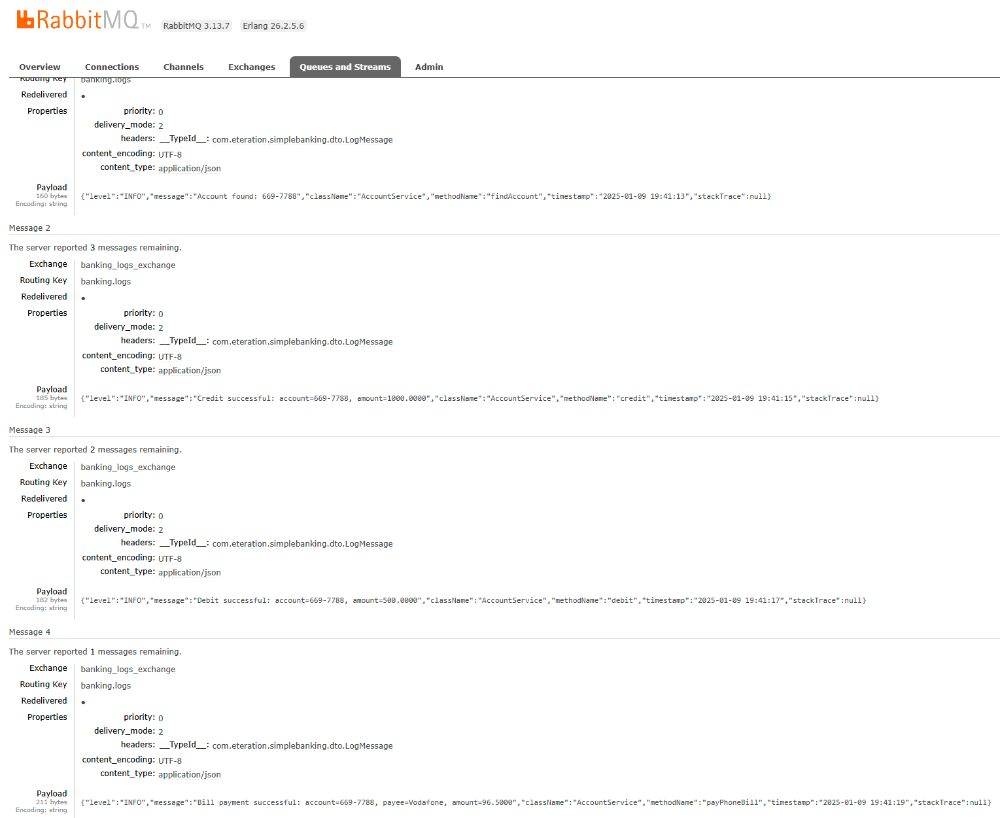
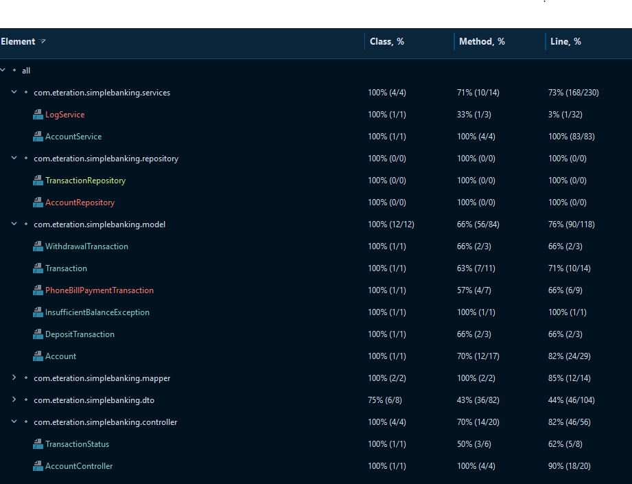

# Simple Banking Application

A Spring Boot based banking application that provides basic banking operations like account management, deposits, withdrawals, and bill payments.

## Technologies Used

- Java 11
- Spring Boot 2.7.14
- PostgreSQL
- Spring Data JPA
- RabbitMQ (for logging)
- Swagger/OpenAPI (for API documentation)
- JUnit 5 & Mockito (for testing)
- Docker & Docker Compose
- Flyway (for database migrations)

## Features

- Account Management
- Deposit Operations
- Withdrawal Operations
- Phone Bill Payment
- Transaction History
- Real-time Logging with RabbitMQ
- API Documentation with Swagger
- Database Migrations with Flyway

## Prerequisites

- Java 11
- Docker and Docker Compose
- PostgreSQL
- Gradle

## Quick Start with Docker

1. Clone the repository:
```bash
git clone https://github.com/yourusername/simplebanking.git
cd simplebanking
```

2. Start the services using Docker Compose:
```bash
docker-compose up -d
```

2. Insert data for postgreSQL container:
```bash
docker-compose exec postgres psql -U postgres -d simplebanking -f /docker-entrypoint-initdb.d/V2__insert_sample_data.sql
```


This will start:
- PostgreSQL database
- RabbitMQ server (check application.properties "app.rabbitmq.logging.enabled" value) 
- The banking application

## Manual Setup

1. Create PostgreSQL database:
```bash
psql -U postgres -c "CREATE DATABASE simplebanking"
```

2. Configure application.properties (if needed):
```properties
spring.datasource.url=jdbc:postgresql://localhost:5432/simplebanking
spring.datasource.username=postgres
spring.datasource.password=postgres
```

3. Run the application:
```bash
./gradlew bootRun
```

## API Documentation

Swagger UI is available at: http://localhost:8080/swagger-ui.html
API Docs are available at: http://localhost:8080/api-docs

## API Endpoints

### Account Operations

- GET /account/v1/{accountNumber} - Get account details
- POST /account/v1/credit/{accountNumber} - Credit (deposit) money
- POST /account/v1/debit/{accountNumber} - Debit (withdraw) money
- POST /account/v1/bill-payment/{accountNumber} - Pay phone bill

## Sample Requests (Postman Collection)

```json
{
  "info": {
    "name": "Simple Banking API",
    "schema": "https://schema.getpostman.com/json/collection/v2.1.0/collection.json"
  },
  "item": [
    {
      "name": "Get Account",
      "request": {
        "method": "GET",
        "url": "http://localhost:8080/account/v1/669-7788"
      }
    },
    {
      "name": "Credit Account",
      "request": {
        "method": "POST",
        "url": "http://localhost:8080/account/v1/credit/669-7788",
        "body": {
          "mode": "raw",
          "raw": "{\"amount\": 1000.0}",
          "options": {
            "raw": {
              "language": "json"
            }
          }
        }
      }
    },
    {
      "name": "Debit Account",
      "request": {
        "method": "POST",
        "url": "http://localhost:8080/account/v1/debit/669-7788",
        "body": {
          "mode": "raw",
          "raw": "{\"amount\": 500.0}",
          "options": {
            "raw": {
              "language": "json"
            }
          }
        }
      }
    },
    {
      "name": "Pay Phone Bill",
      "request": {
        "method": "POST",
        "url": "http://localhost:8080/account/v1/bill-payment/669-7788",
        "body": {
          "mode": "raw",
          "raw": "{\"amount\": 96.50, \"type\": \"Vodafone\", \"approvalCode\": \"5423345566\"}",
          "options": {
            "raw": {
              "language": "json"
            }
          }
        }
      }
    }
  ]
}
```

## Logging

The application uses RabbitMQ for logging. Logs can be viewed in:
- RabbitMQ Management Console: http://localhost:15672
  - Username: guest
  - Password: guest



## Testing

Run the tests using:
```bash
./gradlew test
```


## Coverage Test Results



AccountService Coverage:


AccountController Coverage:


